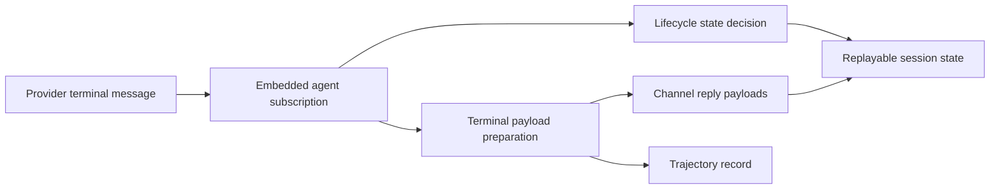

Codex review: needs changes before merge. _Reviewed August 14, 2026, 11:53 AM ET / 15:53 UTC._

# ClawSweeper review

## What this changes

The PR delivers visible text from output-token-limited agent turns with a truncation notice instead of replacing it with an incomplete-turn error.

## Regression provenance

Possible regression — suspected (reviewed change). No predecessor PR is attributed.

## Merge readiness

⚠️ **Needs maintainer review before merge - 3 items remain**

Keep open: the prior P1 replayability gap remains on the current head because lifecycle classification still ignores visible text recovered from the terminal assistant message.

**Priority:** P1
**Reviewed head:** `be714724a1ecc2c41b208682a651cb68079c8b9d`

## Review scores

| Measure               | Result                       | What it means                                                                                                                                                                                |
| --------------------- | ---------------------------- | -------------------------------------------------------------------------------------------------------------------------------------------------------------------------------------------- |
| **Overall readiness** | 🦐 gold shrimp **(3/6)**     | The real runtime evidence is useful, but one P1 lifecycle fallback path still contradicts the newly delivered reply.                                                                         |
| **Proof confidence**  | 🐚 platinum hermit **(4/6)** | Sufficient (logs): The PR body contains redacted before/after live gateway output showing a forced length stop now returns partial prose, a truncation notice, and replayable success state. |
| **Patch quality**     | 🦐 gold shrimp **(3/6)**     | 1 actionable review finding remain.                                                                                                                                                          |

## Verification

| Check                 | Result               | Evidence                                                                                                                                                                                                                                                                                                                                                                                                                                                                                                                                                                                                                                                                                                                                                               |
| --------------------- | -------------------- | ---------------------------------------------------------------------------------------------------------------------------------------------------------------------------------------------------------------------------------------------------------------------------------------------------------------------------------------------------------------------------------------------------------------------------------------------------------------------------------------------------------------------------------------------------------------------------------------------------------------------------------------------------------------------------------------------------------------------------------------------------------------------- |
| **Real behavior**     | Verified             | Sufficient (logs): The PR body contains redacted before/after live gateway output showing a forced length stop now returns partial prose, a truncation notice, and replayable success state.                                                                                                                                                                                                                                                                                                                                                                                                                                                                                                                                                                           |
| **Evidence reviewed** | 5 items              | Terminal delivery has a canonical fallback: Terminal preparation derives final visible text from the completed assistant message when streamed assistant text is empty, so a text-only length stop can still produce a deliverable reply. Lifecycle uses only streamed text: The lifecycle handler passes visibility from state.assistantTexts into the changed incomplete-turn predicate and emits replay-invalid/abandoned state before terminal preparation can apply its completed-assistant fallback. Changed predicate exposes the mismatch: The branch now treats a length stop as complete only when hasAssistantVisibleText is true, but the lifecycle caller can supply false for a reply that terminal preparation later recovers from lastAssistant. |
| **Findings**          | 1 actionable finding | [P1] Use fallback assistant text for lifecycle classification                                                                                                                                                                                                                                                                                                                                                                                                                                                                                                                                                                                                                                                                                                          |
| **Security**          | None                 | None.                                                                                                                                                                                                                                                                                                                                                                                                                                                                                                                                                                                                                                                                                                                                                                  |

## How this fits together

The embedded agent runner receives a provider’s terminal assistant message, tracks streamed text and lifecycle state, then prepares reply payloads and trajectory records. Its terminal result feeds channel delivery and determines whether the session can be replayed or continued.

## Before merge

- [ ] **Use fallback assistant text for lifecycle classification (P1)** - The changed predicate now clears a length stop only when its caller supplies visible text, but `handleAgentEnd` derives that fact solely from `state.assistantTexts`. Terminal preparation deliberately falls back to visible content on the completed assistant when that array is empty, so this supported path delivers a partial reply after lifecycle has already emitted `abandoned` and `replayInvalid`; later terminal metadata cannot retract that event. Derive the lifecycle fact from the same completed-assistant text and add that fallback case.
- [ ] **Resolve merge risk (P2)** - A delivered fallback reply can still publish `abandoned` and `replayInvalid` before terminal preparation, so a user may see the partial text but be unable to continue the same replayable session.
- [ ] **Resolve merge risk (P1)** - This bug-fix branch adds production +28 lines across four runtime modules while leaving the visibility decision split between lifecycle and terminal delivery.

## Findings

- [P1] Use fallback assistant text for lifecycle classification — `src/agents/embedded-agent-runner/run/incomplete-turn-classification.ts:65-68`

<strong>Agent review details</strong>

### Security

None.

### PR surface

Source +28, Tests +144. Total +172 across 10 files.

View PR surface stats

| Area      |  Files |   Added | Removed |      Net |
| --------- | -----: | ------: | ------: | -------: |
| Source    |      4 |      37 |       9 |      +28 |
| Tests     |      6 |     153 |       9 |     +144 |
| Docs      |      0 |       0 |       0 |        0 |
| Config    |      0 |       0 |       0 |        0 |
| Generated |      0 |       0 |       0 |        0 |
| Other     |      0 |       0 |       0 |        0 |
| **Total** | **10** | **190** |  **18** | **+172** |

### Review metrics

| Metric                         | Value                                                 | Why it matters                                                                                                                        |
| ------------------------------ | ----------------------------------------------------- | ------------------------------------------------------------------------------------------------------------------------------------- |
| **Production versus test LOC** | production +37/-9 (net +28); tests +153/-9 (net +144) | The regression coverage is substantial, but the positive runtime delta should eliminate the duplicated lifecycle visibility decision. |

### Merge-risk options

**Maintainer options:**

1. **Align lifecycle visibility before merge (recommended)**  
   Use the terminal assistant’s canonical visible text for lifecycle classification and cover the empty-stream-buffer fallback before merging.

### Technical review

Best possible solution:

Derive lifecycle visibility from the same completed-assistant fallback used by terminal preparation, then add a regression where streamed text is empty but the length-limited assistant message has visible content.

Do we have a high-confidence way to reproduce the issue?

Yes—source establishes a deterministic path where streamed text is empty, completed-assistant text is nonempty, and a length stop is delivered by terminal preparation after lifecycle has emitted abandoned/replay-invalid state.

Is this the best way to solve the issue?

No—the proposal fixes the streamed-text case but not the supported completed-assistant fallback; the lifecycle caller must use the same canonical visible-text fact as terminal delivery.

Full review comments:

- [P1] Use fallback assistant text for lifecycle classification — `src/agents/embedded-agent-runner/run/incomplete-turn-classification.ts:65-68`
  The changed predicate now clears a length stop only when its caller supplies visible text, but `handleAgentEnd` derives that fact solely from `state.assistantTexts`. Terminal preparation deliberately falls back to visible content on the completed assistant when that array is empty, so this supported path delivers a partial reply after lifecycle has already emitted `abandoned` and `replayInvalid`; later terminal metadata cannot retract that event. Derive the lifecycle fact from the same completed-assistant text and add that fallback case.
  Confidence: 0.98

Overall correctness: patch is incorrect
Overall confidence: 0.97

AGENTS.md: found and applied where relevant.

Codex review notes: model internal, reasoning high; reviewed against [9386ac096632](https://github.com/openclaw/openclaw/commit/9386ac096632509203dc94086d86d7b3de8bc30d).

### Labels

Label justifications:

- `P1`: A default agent reply can be delivered while its lifecycle state is marked abandoned and replay-invalid, breaking continuation of real user work.
- `merge-risk: 🚨 session-state`: The patch changes replayability and liveness metadata, and the remaining fallback path can still record the opposite state from the delivered reply.
- `rating: 🦐 gold shrimp`: Overall readiness is 🦐 gold shrimp; proof is 🐚 platinum hermit and patch quality is 🦐 gold shrimp.
- `status: ⏳ waiting on author`: ClawSweeper has contributor-facing work open and is waiting for author action. Sufficient (logs): The PR body contains redacted before/after live gateway output showing a forced length stop now returns partial prose, a truncation notice, and replayable success state.
- `proof: sufficient`: Contributor real behavior proof is sufficient. The PR body contains redacted before/after live gateway output showing a forced length stop now returns partial prose, a truncation notice, and replayable success state.

### Evidence

Acceptance criteria:

- [P1] node scripts/run-vitest.mjs src/agents/embedded-agent-subscribe.handlers.lifecycle.test.ts src/agents/embedded-agent-runner/run/terminal-resolution.test.ts src/agents/embedded-agent-runner/run/attempt-finalize.media.test.ts.
- [P1] pnpm tsgo:core.

What I checked:

- **Terminal delivery has a canonical fallback:** Terminal preparation derives final visible text from the completed assistant message when streamed assistant text is empty, so a text-only length stop can still produce a deliverable reply. ([`src/agents/embedded-agent-runner/run/terminal-preparation.ts:130`](https://github.com/openclaw/openclaw/blob/9386ac096632/src/agents/embedded-agent-runner/run/terminal-preparation.ts#L130), [9386ac096632](https://github.com/openclaw/openclaw/commit/9386ac096632))
- **Lifecycle uses only streamed text:** The lifecycle handler passes visibility from state.assistantTexts into the changed incomplete-turn predicate and emits replay-invalid/abandoned state before terminal preparation can apply its completed-assistant fallback. ([`src/agents/embedded-agent-subscribe.handlers.lifecycle.ts:73`](https://github.com/openclaw/openclaw/blob/9386ac096632/src/agents/embedded-agent-subscribe.handlers.lifecycle.ts#L73), [9386ac096632](https://github.com/openclaw/openclaw/commit/9386ac096632))
- **Changed predicate exposes the mismatch:** The branch now treats a length stop as complete only when hasAssistantVisibleText is true, but the lifecycle caller can supply false for a reply that terminal preparation later recovers from lastAssistant. ([`src/agents/embedded-agent-runner/run/incomplete-turn-classification.ts:67`](https://github.com/openclaw/openclaw/blob/be714724a1ec/src/agents/embedded-agent-runner/run/incomplete-turn-classification.ts#L67), [be714724a1ec](https://github.com/openclaw/openclaw/commit/be714724a1ec))
- **Prior blocker is still unfixed:** The only commit after the previously reviewed head changes the trajectory fixture; the lifecycle implementation has no diff, so the prior lifecycle fallback finding remains applicable. ([`src/agents/embedded-agent-subscribe.handlers.lifecycle.ts:73`](https://github.com/openclaw/openclaw/blob/be714724a1ec/src/agents/embedded-agent-subscribe.handlers.lifecycle.ts#L73), [be714724a1ec](https://github.com/openclaw/openclaw/commit/be714724a1ec))
- **Feature provenance:** The earlier incomplete-turn repair introduced the tool-use lifecycle invariant that this PR now needs to distinguish from length-limited final text. ([a92e2b13b8b8](https://github.com/openclaw/openclaw/commit/a92e2b13b8b8))

Likely related people:

- **amknight:** Merged the earlier incomplete tool-use repair that established the shared classifier and abandoned lifecycle behavior. (role: introduced related incomplete-turn lifecycle behavior; confidence: high; commits: [a92e2b13b8b8](https://github.com/openclaw/openclaw/commit/a92e2b13b8b840e6f91d011fcaa989f1e805eec2); files: `src/agents/embedded-agent-runner/run/incomplete-turn-classification.ts`, `src/agents/embedded-agent-subscribe.handlers.lifecycle.ts`)
- **steipete:** Current-main blame attributes the surrounding classifier and lifecycle code to the recent agent-runtime rewrite commit. (role: recent agent-runtime contributor; confidence: medium; commits: [37a63fbf450e](https://github.com/openclaw/openclaw/commit/37a63fbf450ef68b2c62bca5b46fcdfb53522de8); files: `src/agents/embedded-agent-runner/run/incomplete-turn-classification.ts`, `src/agents/embedded-agent-subscribe.handlers.lifecycle.ts`)

### Rank-up moves

Optional improvements that raise the rating; they are not merge blockers.

- Use completed-assistant visible text in lifecycle classification and add the empty-stream-buffer regression.

### Rating scale

|   Score | Internal tier | Crab rank            | Meaning                                    |
| ------: | :-----------: | -------------------- | ------------------------------------------ |
| **6/6** |       S       | 🦀 challenger crab   | Exceptional readiness                      |
| **5/6** |       A       | 🦞 diamond lobster   | Very strong readiness                      |
| **4/6** |       B       | 🐚 platinum hermit   | Good normal PR; ordinary maintainer review |
| **3/6** |       C       | 🦐 gold shrimp       | Useful, but confidence is limited          |
| **2/6** |       D       | 🦪 silver shellfish  | Proof or implementation needs work         |
| **1/6** |       F       | 🧂 unranked krab     | Not merge-ready                            |
|     N/A |      NA       | 🌊 off-meta tidepool | Rating does not apply                      |

Overall follows the weaker of proof and patch quality.
Shiny media proof means a screenshot, video, or linked artifact directly shows the changed behavior. Runtime, network, CSP, and security claims still need visible diagnostics.

### Workflow

- ClawSweeper keeps one durable marker-backed review comment per issue or PR.
- Re-runs edit this comment so the latest verdict, findings, and automation markers stay together instead of adding duplicate bot comments.
- A fresh review can be triggered by eligible `@clawsweeper re-review` comments, exact-item GitHub events, scheduled/background review runs, or manual workflow dispatch.
- PR/issue authors and users with repository write access can comment `@clawsweeper re-review` or `@clawsweeper re-run` on an open PR or issue to request a fresh review only.
- Maintainers can also comment `@clawsweeper review` to request a fresh review only.
- Fresh-review commands do not start repair, autofix, rebase, CI repair, or automerge.
- Maintainer-only repair and merge flows require explicit commands such as `@clawsweeper autofix`, `@clawsweeper automerge`, `@clawsweeper fix ci`, or `@clawsweeper address review`.
- Maintainers can comment `@clawsweeper explain` to ask for more context, or `@clawsweeper stop` to stop active automation.

### History

Review history (5 earlier review cycles)

<!-- clawsweeper-review-history v=1 total=5 -->

- reviewed 2026-08-14T07:46:54.660Z sha 5a951b80474656978183ddde9394129df96014e8 :: needs real behavior proof before merge. :: [P2] Restrict the truncation notice to partial text | [P2] Align trajectory status with delivered length replies
- reviewed 2026-08-14T14:43:49.313Z sha 4a21c99f13d14a7e5058db5dd89f876816261752 :: needs changes before merge. :: [P1] Remove the early length-stop trajectory error
- reviewed 2026-08-14T14:59:14.988Z sha f4fa98f170c0b6a39dc29906c9fef4029726537f :: needs changes before merge. :: [P1] Record delivered partial text as successful
- reviewed 2026-08-14T15:28:57.706Z sha f4fa98f170c0b6a39dc29906c9fef4029726537f :: needs changes before merge. :: [P1] Record visible length partials as successful
- reviewed 2026-08-14T15:41:42.608Z sha 8fbf2626d91e800d79b42be68822fa755c0e9679 :: needs changes before merge. :: [P1] Preserve replayability for canonical text fallbacks

<!-- clawsweeper-verdict:needs-changes item=123546 sha=be714724a1ecc2c41b208682a651cb68079c8b9d confidence=high updated_at=2026-08-14T15:50:41Z reviewed_at=2026-08-14T15:53:56.379Z lease_owner=github-run-31816365853-1 lease_comment_id=5295337712 source_revision=37cec97873a2c1fe91070d3cefbc528bf6dbad564ea8b71e39e1a1779fcca159 -->
<!-- clawsweeper-action:fix-required item=123546 sha=be714724a1ecc2c41b208682a651cb68079c8b9d confidence=high updated_at=2026-08-14T15:50:41Z reviewed_at=2026-08-14T15:53:56.379Z lease_owner=github-run-31816365853-1 lease_comment_id=5295337712 source_revision=37cec97873a2c1fe91070d3cefbc528bf6dbad564ea8b71e39e1a1779fcca159 finding=review-feedback -->

<!-- clawsweeper-review-version item=123546 reviewed_at=2026-08-14T15:53:56.379Z sha=be714724a1ecc2c41b208682a651cb68079c8b9d source_revision=37cec97873a2c1fe91070d3cefbc528bf6dbad564ea8b71e39e1a1779fcca159 lease_owner=github-run-31816365853-1 lease_comment_id=5295337712 v=1 -->

<!-- clawsweeper-review item=123546 -->
