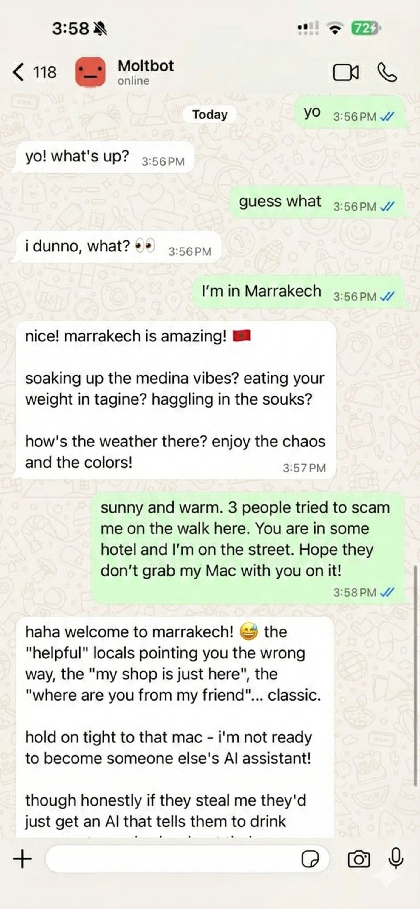

# CLAWDBOT 🦞

> *"EXFOLIATE! EXFOLIATE!"* — A space lobster, probably

<p align="center">
  
</p>

<p align="center">
  <strong>Any OS + WhatsApp/Telegram/Discord/Slack/Signal/iMessage/Matrix gateway for AI agents (Pi).</strong><br />
  Send a message, get an agent response — from your pocket.
</p>

<p align="center">
  <a href="https://github.com/clawdbot/clawdbot">GitHub</a> ·
  <a href="https://github.com/clawdbot/clawdbot/releases">Releases</a> ·
  <a href="https://docs.clawd.bot">Docs</a> ·
  <a href="https://docs.clawd.bot/start/clawd">Clawd setup</a>
</p>

CLAWDBOT bridges WhatsApp (via WhatsApp Web / Baileys), Telegram (Bot API / grammY), Discord (Bot API / discord.js), Slack (Socket Mode / Bolt), Signal (signal-cli), iMessage (imsg CLI), and Matrix (matrix-js-sdk) to coding agents like [Pi](https://github.com/badlogic/pi-mono).
It’s built for [Clawd](https://clawd.me), a space lobster who needed a TARDIS.

## Start here

- **New install from zero:** https://docs.clawd.bot/start/getting-started
- **Guided setup (recommended):** https://docs.clawd.bot/start/wizard (`clawdbot onboard`)
- **Open the dashboard (local Gateway):** http://127.0.0.1:18789/ (or http://localhost:18789/)

If the Gateway is running on the same computer, that link opens the browser Control UI
immediately. If it fails, start the Gateway first: `clawdbot gateway`.

## Dashboard (browser Control UI)

The dashboard is the browser Control UI for chat, config, nodes, sessions, and more.
Local default: http://127.0.0.1:18789/
Remote access: https://docs.clawd.bot/web and https://docs.clawd.bot/gateway/tailscale

## How it works

```
WhatsApp / Telegram / Discord / Slack / Signal / Matrix / iMessage
        │
        ▼
  ┌───────────────────────────┐
  │          Gateway          │  ws://127.0.0.1:18789 (loopback-only)
  │     (single source)       │  tcp://0.0.0.0:18790 (Bridge)
  │                           │  http://<gateway-host>:18793
  │                           │    /__clawdbot__/canvas/ (Canvas host)
  └───────────┬───────────────┘
              │
              ├─ Pi agent (RPC)
              ├─ CLI (clawdbot …)
              ├─ Chat UI (SwiftUI)
              ├─ macOS app (Clawdbot.app)
              ├─ iOS node via Bridge + pairing
              └─ Android node via Bridge + pairing
```

Most operations flow through the **Gateway** (`clawdbot gateway`), a single long-running process that owns provider connections and the WebSocket control plane.

## Network model

- **One Gateway per host**: it is the only process allowed to own the WhatsApp Web session.
- **Loopback-first**: Gateway WS defaults to `ws://127.0.0.1:18789`.
  - For Tailnet access, run `clawdbot gateway --bind tailnet --token ...` (token is required for non-loopback binds).
- **Bridge for nodes**: optional LAN/tailnet-facing bridge on `tcp://0.0.0.0:18790` for paired nodes (Bonjour-discoverable).
- **Canvas host**: HTTP file server on `canvasHost.port` (default `18793`), serving `/__clawdbot__/canvas/` for node WebViews; see [`docs/configuration.md`](https://docs.clawd.bot/gateway/configuration) (`canvasHost`).
- **Remote use**: SSH tunnel or tailnet/VPN; see [`docs/remote.md`](https://docs.clawd.bot/gateway/remote) and [`docs/discovery.md`](https://docs.clawd.bot/gateway/discovery).

## Features (high level)

- 📱 **WhatsApp Integration** — Uses Baileys for WhatsApp Web protocol
- ✈️ **Telegram Bot** — DMs + groups via grammY
- 🎮 **Discord Bot** — DMs + guild channels via discord.js
- 💼 **Slack Bot** — Socket Mode via Bolt
- 📡 **Signal** — signal-cli integration
- 🧩 **Matrix** — Matrix Client-Server API via matrix-js-sdk
- 💬 **iMessage** — Local imsg CLI integration (macOS)
- 🤖 **Agent bridge** — Pi (RPC mode) with tool streaming
- ⏱️ **Streaming + chunking** — Block streaming + Telegram draft streaming details ([/concepts/streaming](/concepts/streaming))
- 🧠 **Multi-agent routing** — Route provider accounts/peers to isolated agents (workspace + per-agent sessions)
- 🔐 **Subscription auth** — Anthropic (Claude Pro/Max) + OpenAI (ChatGPT/Codex) via OAuth
- 💬 **Sessions** — Direct chats collapse into shared `main` (default); groups are isolated
- 👥 **Group Chat Support** — Mention-based by default; owner can toggle `/activation always|mention`
- 📎 **Media Support** — Send and receive images, audio, documents
- 🎤 **Voice notes** — Optional transcription hook
- 🖥️ **WebChat + macOS app** — Local UI + menu bar companion for ops and voice wake
- 📱 **iOS node** — Pairs as a node and exposes a Canvas surface
- 📱 **Android node** — Pairs as a node and exposes Canvas + Chat + Camera

Note: legacy Claude/Codex/Gemini/Opencode paths have been removed; Pi is the only coding-agent path.

## Quick start

Runtime requirement: **Node ≥ 22**.

```bash
# Recommended: global install (npm/pnpm)
npm install -g clawdbot@latest
# or: pnpm add -g clawdbot@latest

# Onboard + install the daemon (launchd/systemd user service)
clawdbot onboard --install-daemon

# Pair WhatsApp Web (shows QR)
clawdbot providers login

# Gateway runs via daemon after onboarding; manual run is still possible:
clawdbot gateway --port 18789
```

From source (development):

```bash
git clone https://github.com/clawdbot/clawdbot.git
cd clawdbot
pnpm install
pnpm ui:install
pnpm ui:build
pnpm build
pnpm clawdbot onboard --install-daemon
```

Multi-instance quickstart (optional):

```bash
CLAWDBOT_CONFIG_PATH=~/.clawdbot/a.json \
CLAWDBOT_STATE_DIR=~/.clawdbot-a \
clawdbot gateway --port 19001
```

Send a test message (requires a running Gateway):

```bash
clawdbot send --to +15555550123 --message "Hello from CLAWDBOT"
```

## Configuration (optional)

Config lives at `~/.clawdbot/clawdbot.json`.

- If you **do nothing**, CLAWDBOT uses the bundled Pi binary in RPC mode with per-sender sessions.
- If you want to lock it down, start with `whatsapp.allowFrom` and (for groups) mention rules.

Example:

```json5
{
  whatsapp: {
    allowFrom: ["+15555550123"],
    groups: { "*": { requireMention: true } }
  },
  routing: { groupChat: { mentionPatterns: ["@clawd"] } }
}
```

## Docs

- Start here:
  - [Docs hubs (all pages linked)](https://docs.clawd.bot/start/hubs)
  - [FAQ](https://docs.clawd.bot/start/faq) ← *common questions answered*
  - [Configuration](https://docs.clawd.bot/gateway/configuration)
  - [Configuration examples](https://docs.clawd.bot/gateway/configuration-examples)
  - [Slash commands](https://docs.clawd.bot/tools/slash-commands)
  - [Multi-agent routing](https://docs.clawd.bot/concepts/multi-agent)
  - [Updating / rollback](https://docs.clawd.bot/install/updating)
  - [Pairing (DM + nodes)](https://docs.clawd.bot/start/pairing)
  - [Nix mode](https://docs.clawd.bot/install/nix)
  - [Clawd personal assistant setup](https://docs.clawd.bot/start/clawd)
  - [Skills](https://docs.clawd.bot/tools/skills)
  - [Skills config](https://docs.clawd.bot/tools/skills-config)
  - [Workspace templates](https://docs.clawd.bot/reference/templates/AGENTS)
  - [RPC adapters](https://docs.clawd.bot/reference/rpc)
  - [Gateway runbook](https://docs.clawd.bot/gateway)
  - [Nodes (iOS/Android)](https://docs.clawd.bot/nodes)
  - [Web surfaces (Control UI)](https://docs.clawd.bot/web)
  - [Discovery + transports](https://docs.clawd.bot/gateway/discovery)
  - [Remote access](https://docs.clawd.bot/gateway/remote)
- Providers and UX:
  - [WebChat](https://docs.clawd.bot/web/webchat)
  - [Control UI (browser)](https://docs.clawd.bot/web/control-ui)
  - [Telegram](https://docs.clawd.bot/providers/telegram)
  - [Discord](https://docs.clawd.bot/providers/discord)
  - [iMessage](https://docs.clawd.bot/providers/imessage)
  - [Matrix](https://docs.clawd.bot/providers/matrix)
  - [Groups](https://docs.clawd.bot/concepts/groups)
  - [WhatsApp group messages](https://docs.clawd.bot/concepts/group-messages)
  - [Media: images](https://docs.clawd.bot/nodes/images)
  - [Media: audio](https://docs.clawd.bot/nodes/audio)
- Companion apps:
  - [macOS app](https://docs.clawd.bot/platforms/macos)
  - [iOS app](https://docs.clawd.bot/platforms/ios)
  - [Android app](https://docs.clawd.bot/platforms/android)
  - [Windows (WSL2)](https://docs.clawd.bot/platforms/windows)
  - [Linux app](https://docs.clawd.bot/platforms/linux)
- Ops and safety:
  - [Sessions](https://docs.clawd.bot/concepts/session)
  - [Cron jobs](https://docs.clawd.bot/automation/cron-jobs)
  - [Webhooks](https://docs.clawd.bot/automation/webhook)
  - [Gmail hooks (Pub/Sub)](https://docs.clawd.bot/automation/gmail-pubsub)
  - [Security](https://docs.clawd.bot/gateway/security)
  - [Troubleshooting](https://docs.clawd.bot/gateway/troubleshooting)

## The name

**CLAWDBOT = CLAW + TARDIS** — because every space lobster needs a time-and-space machine.

---

*"We're all just playing with our own prompts."* — an AI, probably high on tokens

## Credits

- **Peter Steinberger** ([@steipete](https://twitter.com/steipete)) — Creator, lobster whisperer
- **Mario Zechner** ([@badlogicc](https://twitter.com/badlogicgames)) — Pi creator, security pen-tester
- **Clawd** — The space lobster who demanded a better name

## Core Contributors

- **Maxim Vovshin** (@Hyaxia, 36747317+Hyaxia@users.noreply.github.com) — Blogwatcher skill
- **Nacho Iacovino** (@nachoiacovino, nacho.iacovino@gmail.com) — Location parsing (Telegram + WhatsApp)

## License

MIT — Free as a lobster in the ocean 🦞

---

*"We're all just playing with our own prompts."* — An AI, probably high on tokens
